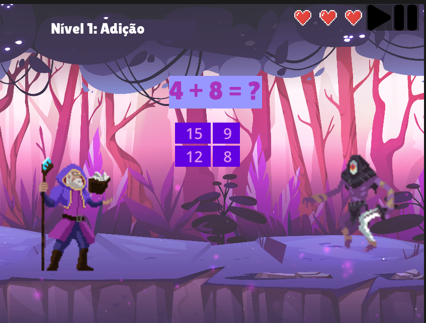
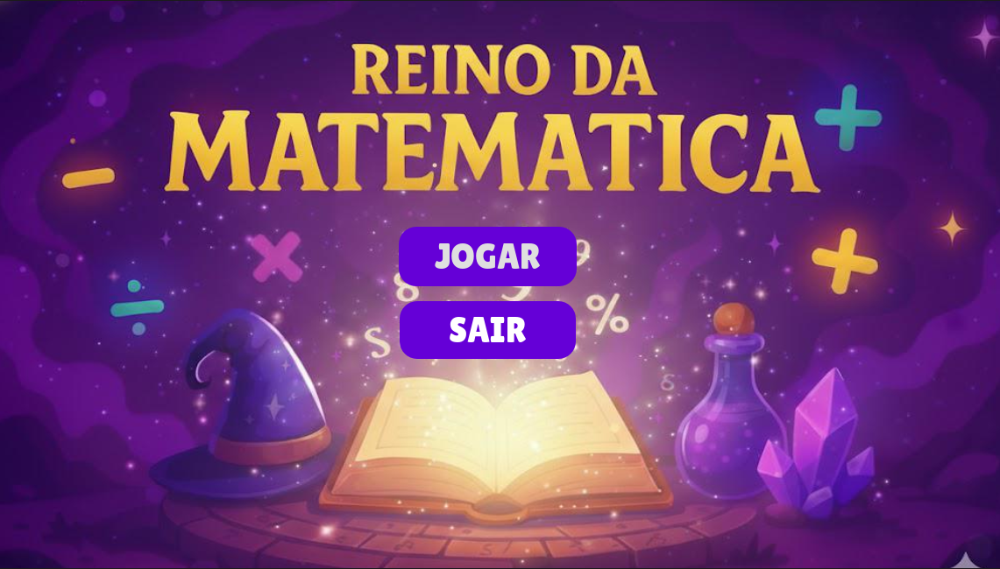
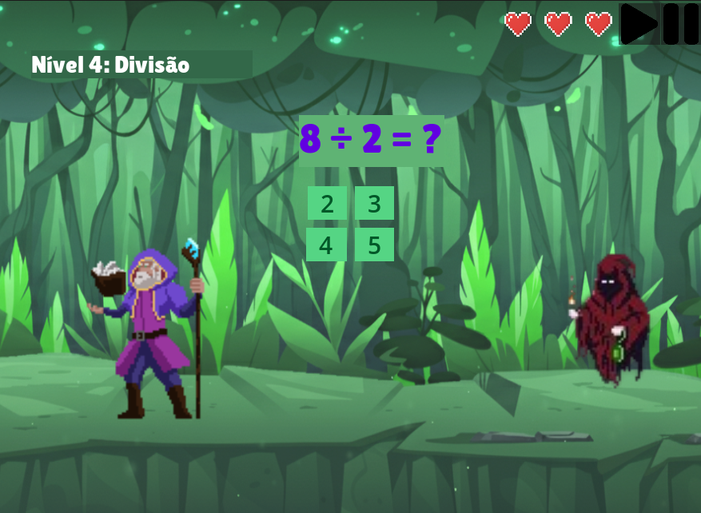

# 🏰 Reino Matemágica

O **Reino Matemágica** é um jogo educativo 2D desenvolvido com a **Godot Engine**, projetado para unir aprendizado de matemática com mecânicas interativas e divertidas de jogos de plataforma.

---

## 📸 Capturas de Tela

| Nível / Gameplay | Interface |
| :---: | :---: |
| ) |  |
| ) |  |

---

## 🎮 Mecânicas do Jogo

- **Aventura & Plataforma:** Explore cenários e avance pelos níveis vencendo desafios.
- **Desafios Matemáticos:** Resolva questões e enigmas para progredir na história.
- **Sistema de Fases:** Avanço progressivo através das telas de novos níveis (`telaproxnivel`).

---

## 🛠️ Tecnologias Utilizadas

- **Engine:** [Godot Engine](https://godotengine.org/) (2D)
- **Linguagem:** GDScript
- **Versionamento:** Git & GitHub

---

## 🚀 Como Executar o Projeto

1. Certifique-se de ter a **Godot Engine** instalada em seu computador.
2. Clone este repositório:
   ```bash
   git clone [https://github.com/isabellaanton/ReinoMatemagica.git](https://github.com/isabellaanton/ReinoMatemagica.git)
